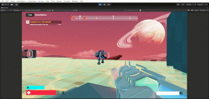

# 🚀 Guerrilla Game Festival 2024 – Proyecto HIVEMIND (4º premio)

## 🏆 Introducción: Presentación y Reto del Concurso

El **Guerrilla Game Festival** es la principal competición universitaria de videojuegos en España, reuniendo cada año a los mejores talentos jóvenes de todo el país.  
En 2024, tras una exigente fase de selección, los equipos finalistas fuimos invitados a Madrid para enfrentarnos a un desafío: **modificar y reinventar un shooter en Unity**, creando una demo jugable completamente original, **en tan solo 4 días**.

> El reto:  
> - Idear, diseñar e implementar una mecánica inédita que aportara frescura a un género saturado como el shooter.  
> - Preparar una presentación profesional y jugable para mostrar ante un jurado de primer nivel (Tequila Works, Electronic Arts, MercurySteam...).

Esta edición se caracterizó por el **tiempo límite extremo**, la presión real de “game jam” y la presencia de la élite del desarrollo nacional, lo que hizo que cada minuto y cada decisión fueran determinantes.

---

## 📚 Tabla de Contenidos

1. [La Idea: ¿Qué aportamos?](#-la-idea--qué-aportamos)
2. [Cambio de Cuerpo: Mecánica Principal](#-cambio-de-cuerpo-mecánica-principal)
3. [Otros Cambios y Mejoras](#-otros-cambios-y-mejoras)
4. [Futuro Desarrollo](#-futuro-desarrollo)
5. [Agradecimientos](#-agradecimientos)

---

## 💡 La Idea: ¿Qué aportamos?

En un sector donde innovar en shooters es cada vez más complicado, apostamos por una mecánica disruptiva con alto potencial tanto jugable como narrativo:  
**La Mente Colmena ("Hivemind") y el Cambio de Cuerpo ("Change Body")**.

  
  
<i>Esquema Inicia</i>

---

## 🧠 Cambio de Cuerpo – Mecánica Principal

  
  
<i>GIF: Cambio de cuerpo en tiempo real</i>

- **Dispara a un aliado para tomar el control de su cuerpo.**
- Estrategia y creatividad en combate, posibilidades narrativas únicas.
- Feedback visual inmediato:  
  -  Mira roja a enemigos  

---

## 🛠️ Otros Cambios y Mejoras

  
  
<i>GIF: Recorrido dinámico y sistema de spawn</i>

- Recorridos mejorados
- Habilidades especiales según el cuerpo controlado
- Prototipo funcional para testeo y feedback rápido

---

## 🚀 Futuro Desarrollo

- Expansión narrativa y jugable
- IA que también pueda cambiar de cuerpo
- Modo cooperativo/competitivo
- Habilidades únicas por personaje

---

## 🙏 Agradecimientos

> Proyecto presentado en el Guerrilla Game Festival 2024  
> Sergio Jiménez Carrillo – UJI  
> serjicama@gmail.com

---

